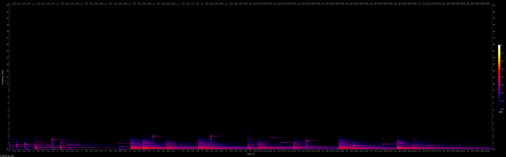
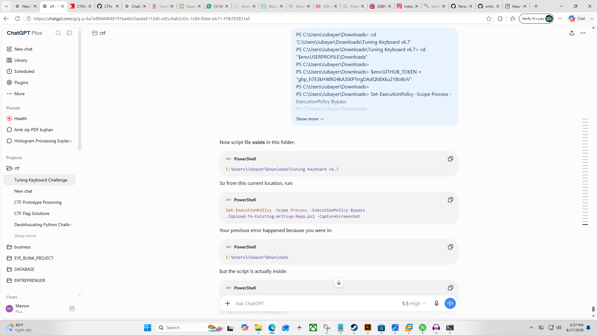

# Tuning Keyboard v6.7 — CTF Writeup

## Challenge Information

**Challenge name:** Tuning Keyboard v6.7  
**Category:** Misc / Audio  
**Flag format:** `gaslightCTF{...}`  
**Given file:** `ttyut-iiiuy+12.wav`

**Description:**

> this song's ending sounds a bit strange...

**Note:**

> insert brackets as appropriate, there is no other punctuation

---

## Final Flag

```text
gaslightCTF{p14n0_1n_r0bl0x_1s_h4rd}
```

---

## Beginner Summary

The challenge gave us a WAV audio file. At first, it sounds like a normal piano version of **Wavin' Flag**, but the ending sounds strange.

The most important clue is the filename:

```text
ttyut-iiiuy+12.wav
```

The `+12` means the notes were shifted **up by 12 semitones**, which is one full octave.

The hint was:

```text
Tune it
```

So the correct idea is to tune the audio **down by 12 semitones**, inspect the strange ending, and map the piano notes to Roblox / Virtual Piano keyboard keys.

After mapping the notes, the message becomes:

```text
p14n0 1n r0bl0x 1s h4rd
```

Spaces are not allowed in the flag, so spaces were replaced with underscores:

```text
gaslightCTF{p14n0_1n_r0bl0x_1s_h4rd}
```

---

## Screenshots

### Sonic Visualiser Spectrogram



If available, this screenshot shows the tuned-down ending in spectrogram view. The bright horizontal lines are piano notes.

### Manual Screenshot



This is optional. It can show Audacity or Sonic Visualiser during the solve process.

---

## Step 1: Check the File Type

First, check what kind of file we have:

```bash
file "ttyut-iiiuy+12.wav"
```

Output:

```text
RIFF (little-endian) data, WAVE audio, Microsoft PCM, 16 bit, stereo 44100 Hz
```

This confirms it is a normal WAV audio file.

---

## Step 2: Check Metadata

Then check metadata:

```bash
exiftool "ttyut-iiiuy+12.wav"
```

Important metadata:

```text
Product  : gaslightCTF
Album    : gaslightCTF
Comment  : sorry if you are a musician and this offended you
Piano    : Imperial V2
Title    : Wavin' Flag
Game ID  : 5593470048
```

These fields give important clues:

| Metadata | Meaning |
|---|---|
| `Title: Wavin' Flag` | The song is Wavin' Flag |
| `Piano: Imperial V2` | The audio is related to piano notes |
| `Game ID: 5593470048` | Points toward Roblox Visual Pianos |
| `Comment` | A decoy/hint that the music was modified |

The metadata comment looks suspicious, but it is not the flag.

---

## Step 3: Understand the Filename

The filename is:

```text
ttyut-iiiuy+12.wav
```

The first part, `ttyut-iiiuy`, looks like a Virtual Piano / Roblox piano keyboard sequence.

The second part, `+12`, is the main clue.

In music:

```text
12 semitones = 1 octave
```

So `+12` means the audio was shifted up by one octave.

To fix the audio, we need to shift it down by 12 semitones.

---

## Step 4: Why Tuning Down Works

Pitch shifting follows this formula:

```text
New frequency = Old frequency × 2^(semitones / 12)
```

For this challenge:

```text
semitones = -12
```

So:

```text
New frequency = Old frequency × 2^(-12 / 12)
New frequency = Old frequency × 2^-1
New frequency = Old frequency × 0.5
```

This means every note becomes half its frequency, which moves it down by one octave.

Example:

```text
A5 = 880 Hz
880 × 0.5 = 440 Hz
440 Hz = A4
```

That is why the hint **“Tune it”** works.

---

## Step 5: Tune the Audio Down

Use `sox`:

```bash
sox "ttyut-iiiuy+12.wav" tuned_down.wav pitch -1200
```

Explanation:

```text
100 cents = 1 semitone
1200 cents = 12 semitones
pitch -1200 = shift down by 12 semitones
```

This creates:

```text
tuned_down.wav
```

---

## Step 6: Extract the Strange Ending

The description says the ending sounds strange, so extract the last 20 seconds:

```bash
ffmpeg -y -sseof -20 -i tuned_down.wav -ac 1 -ar 44100 ending.wav
```

Explanation:

| Option | Meaning |
|---|---|
| `-sseof -20` | Take last 20 seconds |
| `-ac 1` | Convert to mono |
| `-ar 44100` | Keep sample rate |
| `ending.wav` | Output file |

---

## Step 7: Open in Sonic Visualiser

Open the ending:

```bash
sonic-visualiser ending.wav
```

Then:

```text
Pane → Add Spectrogram
```

Recommended settings:

```text
Color Scale      : dB
Window Size      : 8192
Frequency Scale  : Log
Bins             : All Bins
```

These settings make piano notes easier to see.

---

## Step 8: Read the Spectrogram

In the spectrogram, piano notes appear as bright horizontal lines.

A single piano note creates multiple horizontal lines because of harmonics.

Important rule:

```text
Read the lowest strong horizontal line.
Ignore upper harmonic lines.
```

The lowest strong line gives the actual piano note.

---

## Step 9: Map Notes to Roblox / Virtual Piano Keys

The metadata gives:

```text
Game ID: 5593470048
```

This points to Roblox Visual Pianos.

Roblox / Virtual Piano maps piano notes to computer keyboard characters.

So the decoding method is:

```text
audio note → piano note → Roblox keyboard key
```

After tuning down, the ending notes are:

```text
A4  C2  F2  B6  E3     C2  B6     B3  E3  A6  C6  E3  E6     C2  C5     G5  F2  B3  D5
```

The needed mapping table:

| Piano Note | Keyboard Key |
|---|---|
| C2 | `1` |
| F2 | `4` |
| E3 | `0` |
| B3 | `r` |
| A4 | `p` |
| C5 | `s` |
| D5 | `d` |
| G5 | `h` |
| C6 | `l` |
| E6 | `x` |
| A6 | `b` |
| B6 | `n` |

Now decode:

```text
A4  C2  F2  B6  E3
p   1   4   n   0
```

This gives:

```text
p14n0
```

Next:

```text
C2  B6
1   n
```

This gives:

```text
1n
```

Next:

```text
B3  E3  A6  C6  E3  E6
r   0   b   l   0   x
```

This gives:

```text
r0bl0x
```

Next:

```text
C2  C5
1   s
```

This gives:

```text
1s
```

Finally:

```text
G5  F2  B3  D5
h   4   r   d
```

This gives:

```text
h4rd
```

The hidden message is:

```text
p14n0 1n r0bl0x 1s h4rd
```

Meaning:

```text
piano in roblox is hard
```

---

## Step 10: Format the Flag

The decoded message contains spaces:

```text
p14n0 1n r0bl0x 1s h4rd
```

The flag format does not allow spaces, so use underscores:

```text
p14n0_1n_r0bl0x_1s_h4rd
```

Final flag:

```text
gaslightCTF{p14n0_1n_r0bl0x_1s_h4rd}
```

---

## Audacity Method

This can also be solved using Audacity.

1. Open the file:

```text
File → Open → ttyut-iiiuy+12.wav
```

2. Select the full audio:

```text
Ctrl + A
```

3. Open pitch change:

```text
Effect → Pitch and Tempo → Change Pitch
```

4. Set:

```text
Semitones = -12
```

5. Apply.

6. Change track view:

```text
Track Dropdown → Spectrogram
```

7. Suggested settings:

```text
Scale          : Logarithmic
Min Frequency  : 50 Hz
Max Frequency  : 3000 Hz
Window Size    : 8192
```

8. Zoom into the last 20 seconds and read the notes.

---

## Full Command Summary

```bash
cd "/mnt/c/Users/Jubayer/Downloads/Tuning Keyboard v6.7"

file "ttyut-iiiuy+12.wav"

exiftool "ttyut-iiiuy+12.wav"

sox "ttyut-iiiuy+12.wav" tuned_down.wav pitch -1200

ffmpeg -y -sseof -20 -i tuned_down.wav -ac 1 -ar 44100 ending.wav

sonic-visualiser ending.wav
```

---

## Why This Works

The hidden message is encoded in the piano notes at the strange ending.

The notes are not readable at first because the file was shifted up by 12 semitones.

The filename gives the clue:

```text
+12
```

The hint says:

```text
Tune it
```

After tuning the audio down by 12 semitones, the piano notes match Roblox / Virtual Piano keyboard keys.

The decoded message is:

```text
p14n0 1n r0bl0x 1s h4rd
```

So the final flag is:

```text
gaslightCTF{p14n0_1n_r0bl0x_1s_h4rd}
```
